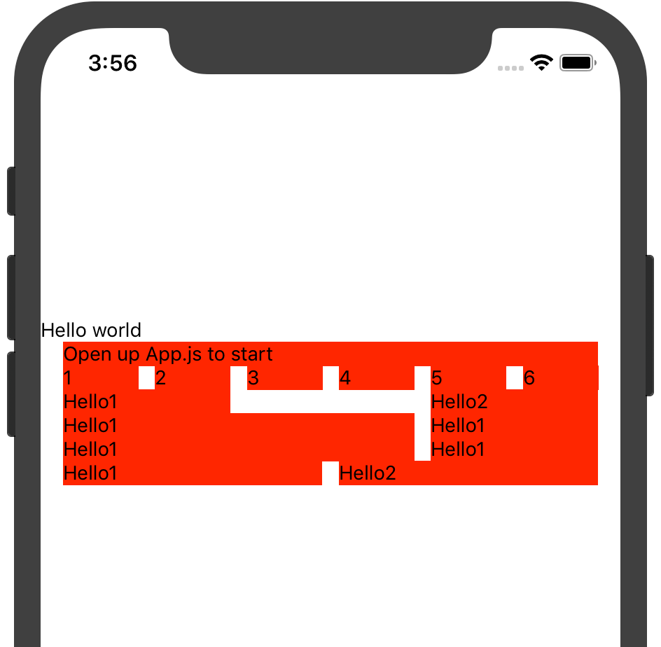

# Grid

[![npm package][npm-badge]][npm-url]
[![npm downloads][npm-downloads]][npm-url]
[![github][git-badge]][git-url]

[npm-badge]: https://img.shields.io/npm/v/@_nu/react-native-grid.svg
[npm-url]: https://www.npmjs.org/package/@_nu/react-native-grid
[npm-downloads]: https://img.shields.io/npm/dw/@_nu/react-native-grid
[git-url]: https://github.com/nu-system/react-native-grid
[git-badge]: https://img.shields.io/github/stars/nu-system/react-native-grid.svg?style=social

这是 NU 「 no-ui 」 组件库系统 nu-system，Grid 组件 React-native 实现。

## 怎么用？

```bash
yarn add @_nu/react-native-grid
```

### 二次封装

```JSX
import React from 'react';
import Grid from '@_nu/react-native-grid';

const {Row, Col, Wrap} = new Grid({
    gridNum: 6,            // 列数
    gutterInside: 12,      // 内间距宽
    gutterOutSide: 16      // 外间距宽
});

export default Grid;
export {Row, Col, Wrap};
```

### 使用

```JSX
import React from 'react';
import {StyleSheet, Text, View} from 'react-native';
import {Row, Col, Wrap} from "./components/Grid/index.js";

export default function App() {
    return (
        <View>
            <Text>Hello world</Text>
            <Wrap>
                <Text style={styles.col}>Open up App.js to start</Text>
            </Wrap>
            <Row>
                <Col span={1}><Text style={styles.col}>1</Text></Col>
                <Col span={1}><Text style={styles.col}>2</Text></Col>
                <Col span={1}><Text style={styles.col}>3</Text></Col>
                <Col span={1}><Text style={styles.col}>4</Text></Col>
                <Col span={1}><Text style={styles.col}>5</Text></Col>
                <Col span={1}><Text style={styles.col}>6</Text></Col>
            </Row>
            <Row>
                <Col span={2}><Text style={styles.col}>Hello1</Text></Col>
                <Col span={2} offset={2}><Text style={styles.col}>Hello2</Text></Col>
                <Col span={4} widthToInt><Text style={styles.col}>Hello1</Text></Col>
                <Col span={2}><Text style={styles.col}>Hello1</Text></Col>
                <Col span={4}><Text style={styles.col}>Hello1</Text></Col>
                <Col span={2}><Text style={styles.col}>Hello1</Text></Col>
            </Row>
            <Row>
                <Col span={3}><Text style={styles.col}>Hello1</Text></Col>
                <Col span={3}><Text style={styles.col}>Hello2</Text></Col>
            </Row>
        </View>
    );
}
```



### Api `Grid`

| props         |  类型  | 默认值 |                 功能 |
| :------------ | :----: | :----: | -------------------: |
| gridNum       | number |  `6`   |                 列数 |
| gutterInside  | number |  `12`  |         列之间的间距 |
| gutterOutSide | number |  `16`  | 列距离屏幕边缘的间距 |

### Api `Col`

| props      |  类型  | 默认值  |                               功能 |
| :--------- | :----: | :-----: | ---------------------------------: |
| span       | number |   `1`   |                         所占的列数 |
| offset     | number |   `0`   |                         偏移的列数 |
| widthToInt |  bool  | `false` | 是否单位采用整数，默认是采用百分比 |
